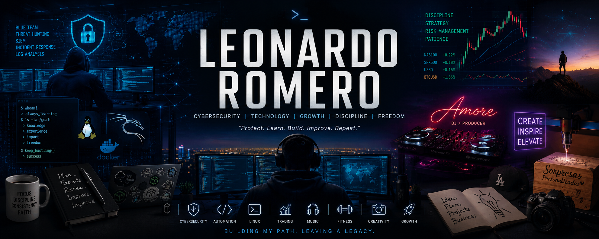

<p align="center">
  
</p>

### SOC Analyst • Blue Team • Incident Response • Digital Forensics


</div>

---

## Who Am I

Cybersecurity student focused on **Security Operations**, **Blue Team**, **Threat Detection**, and **Incident Response**.

I enjoy building realistic investigations, documenting every finding, and transforming hands-on labs into professional case studies.

My objective is to become a SOC Analyst capable of detecting, investigating and responding to real-world attacks.

---

## Current Mission

```text
Learning > Practicing > Documenting > Improving > Repeating
```

Current focus:

- Security Operations Center (SOC)
- Incident Response
- Digital Forensics
- Threat Hunting
- Detection Engineering
- Windows Internals
- Linux Administration
- Network Security
- SIEM Engineering

---

## Technical Stack

<p align="center">


</p>

<p align="center">


</p>

---

## Featured Investigations

| Investigation | Skills |
|---------------|--------|
| QuantiaPay Incident Response | DFIR • Timeline Analysis • Evidence Collection |
| Windows Event Log Analysis | Sysmon • Event Viewer • IOC Detection |
| Threat Hunting Lab | MITRE ATT&CK • Sigma • Detection Logic |
| Network Investigation | Wireshark • PCAP Analysis |
| Linux Hardening | SSH • Permissions • Services |

---

## GitHub Analytics

<p align="center">


</p>

<p align="center">


</p>

---

## Cybersecurity Roadmap

```text
[x] Networking Fundamentals

[x] Linux

[x] Windows

[x] Digital Forensics

[x] Incident Response

[ ] Detection Engineering

[ ] Malware Analysis

[ ] Threat Intelligence

[ ] Cloud Security

[ ] SOC Analyst L1
```

---

## Latest Projects

<!-- BLOG-POST-LIST:START -->
Coming soon...
<!-- BLOG-POST-LIST:END -->

---

## Connect

<p align="left">

<a href="https://www.linkedin.com/in/leonardo-romero-garcia-086798417">

</a>

</p>

---

<div align="center">

> "Protect. Learn. Build. Improve. Repeat."

